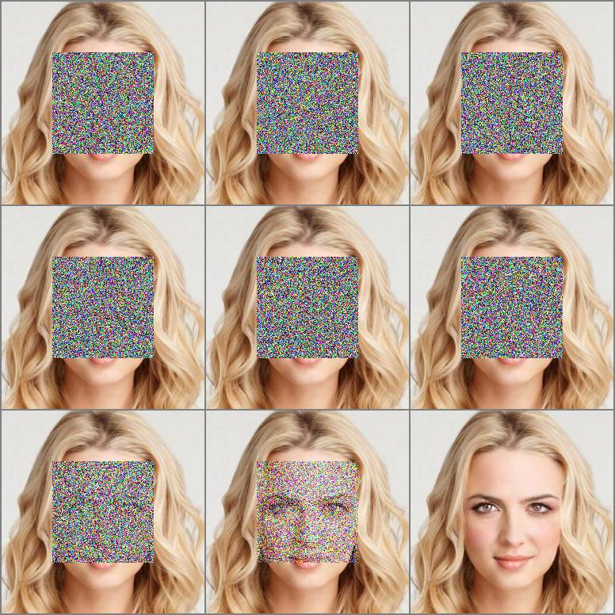
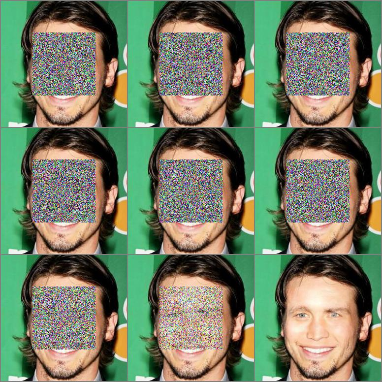

# Palette: Image-to-Image Diffusion Models

[Paper](https://arxiv.org/pdf/2111.05826.pdf ) |  [Project](https://iterative-refinement.github.io/palette/ )

## Brief

This is an unofficial implementation of **Palette: Image-to-Image Diffusion Models** by **Pytorch**, and it is mainly inherited from its super-resolution version [Image-Super-Resolution-via-Iterative-Refinement](https://github.com/Janspiry/Image-Super-Resolution-via-Iterative-Refinement). The code template is from my another seed project: [distributed-pytorch-template](https://github.com/Janspiry/distributed-pytorch-template).

There are some implementation details with paper descriptions:

- We adapted the U-Net architecture used in  `Guided-Diffusion`, which give a substantial boost to sample quality.
- We used the attention mechanism in low-resolution features (16×16) like vanilla `DDPM`.
- We encode the $\gamma$ rather than $t$ in `Palette` and embed it with affine transformation.
- We fix the variance $Σ_\theta(x_t, t)$ to a constant during the inference as described in `Palette`.

## Status

### Code
- [x] Diffusion Model Pipeline
- [x] Train/Test Process
- [x] Save/Load Training State
- [x] Logger/Tensorboard
- [x] Multiple GPU Training (DDP)
- [x] EMA
- [x] Metrics (now for FID, IS)
- [ ] Dataset (now for inpainting, uncropping)

### Task

I try to finish following tasks in order:
- [x] Inpainting on [CelebaHQ](https://drive.google.com/drive/folders/1CjZAajyf-jIknskoTQ4CGvVkAigkhNWA?usp=sharing)🚀 (available)
- [ ] Inpainting on Places2 with 128×128 center mask🔥
- [ ] Uncropping on Places2🔥 
- [ ] Colorization on ImageNet val set 

## Results

### Visuals

#### Celeba-HQ

Results with 200 epochs and 930K iterations, and the first 100 samples in [centering mask](https://drive.google.com/drive/folders/10zyHZtYV5vCht2MGNCF8WzpZJT2ae2RS?usp=sharing) and [irregular mask](https://drive.google.com/drive/folders/1vmSI-R9J2yQZY1cVkSSZlTYil2DprzvY?usp=sharing). 

|  |      |
| ------------------------------------------------ | ---- |


### Metrics

| Tasks        | Dataset | EMA | FID(-) | IS(+) |
| -------------------- | ----------- | -------- | ---- | -------------------- |
| Inpainting with centering mask | Celeba-HQ | False | 5.7873 | 3.0705 |
| Inpainting with irregular mask | Celeba-HQ | False | 5.4026 | 3.1221 |
| Inpainting with centering mask | Places2 | True |  |  |
| Uncropping | Places2 | True |  |  |

## Usage
### Environment
```python
pip install -r requirement.txt
```

### Pre-trained Model

| Dataset   | Task       | Iterations | URL                                                          |
| --------- | ---------- | ---------- | ------------------------------------------------------------ |
| Celeba-HQ | Inpainting | 930K       | [Google Drive](https://drive.google.com/drive/folders/13YZ2UAmGJ-b7DICr-FDAPM7gctreJEoH?usp=sharing) |


### Data Prepare

We get most of them from Kaggle, which may be slightly different from official  version, and you also can download them from official website.
- [CelebA-HQ resized (256x256) Kaggle](https://www.kaggle.com/datasets/badasstechie/celebahq-resized-256x256)
- [Places2 Official](http://places2.csail.mit.edu/download.html) | [Places2 Kaggle](https://www.kaggle.com/datasets/nickj26/places2-mit-dataset?resource=download)
- [ImageNet Official](https://www.image-net.org/download.php)

We use the default division of these datasets for training and evaluation. After you prepared own data, you need to modify the corresponding configure file to point to your data. Take the following as an example:

```yaml
"which_dataset": {  // import designated dataset using arguments 
    "name": ["data.dataset", "InpaintDataset"], // import Dataset() class
    "args":{ // arguments to initialize dataset
    	"data_root": "your data path",
    	"data_len": -1,
    	"mask_mode": "hybrid"
    } 
},
```

More choices about **dataloader** and **validation split** also can be found in `datasets`  part of configure file.

### Training/Resume Training
1. Download the checkpoints from given links.
1. Set `resume_state` of configure file to the directory of previous checkpoint. Take the following as an example, this directory contains training states and saved model:

```yaml
"path": { //set every part file path
	"resume_state": "experiments/inpainting_celebahq_220426_150122/checkpoint/100" 
},
```
2. Set your network label in `load_everything` function of `model.py`, default is **Network**. Follow the tutorial settings, the optimizers and models will be loaded from 100.state and 100_Network.pth respectively.

```python
netG_label = self.netG.__class__.__name__
self.load_network(network=self.netG, network_label=netG_label, strict=False)
```

3. Run the script:

```python
python run.py -p train -c config/inpainting_celebahq.json
```

We test the U-Net backbone used in `SR3` and `Guided Diffusion`,  and `Guided Diffusion` one have a more robust performance in our current experiments.  More choices about **backbone**, **loss** and **scheduler** can be found in `which_networks`  part of configure file.

### Test

1. Modify the configure file to point to your data following the steps in **Data Prepare** part.
2. Set your model path following the steps in **Resume Training** part.
3. Run the script:
```python
python run.py -p test -c config/inpainting_celebahq.json
```

### Evaluation
1. Create two folders saving ground truth images and sample images, and their file names need to correspond to each other.

2. Run the script:

```python
python eval.py -s [ground image path] -d [sample image path]
```


## Acknowledge
Our work is based on the following theoretical works:
- [Denoising Diffusion Probabilistic Models](https://arxiv.org/pdf/2006.11239.pdf)
- [Palette: Image-to-Image Diffusion Models](https://arxiv.org/pdf/2111.05826.pdf)
- [Diffusion Models Beat GANs on Image Synthesis](https://arxiv.org/abs/2105.05233)

and we are benefiting a lot from the following projects:
- [openai/guided-diffusion](https://github.com/openai/guided-diffusion)
- [LouisRouss/Diffusion-Based-Model-for-Colorization](https://github.com/LouisRouss/Diffusion-Based-Model-for-Colorization)
